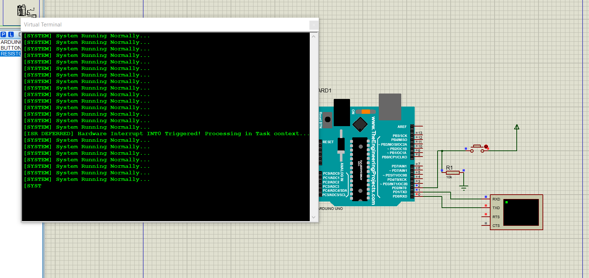

# FreeRTOS ATmega328P - Deferred Interrupt Processing (Interruption Différée)

Ce projet illustre l'implémentation du pattern **Deferred Interrupt Processing** sous **FreeRTOS** sur un microcontrôleur **ATmega328P** (Arduino Uno), simulé sous **Proteus VSM**.

---

## 🎯 Pourquoi cette architecture dans la réalité ? (Cas d'usage industriel)

Dans les systèmes critiques embarqués (Aéronautique, Défense, Automobile) :
- **Règle absolue :** Une routine d'interruption (**ISR**) doit être la plus courte possible (quelques microsecondes) pour ne pas bloquer le système ni rater d'autres interruptions matérielles prioritaires.
- **Problématique :** Traiter un événement (ex: lire un capteur via I2C/SPI, formater un paquet réseau, écrire sur l'UART) demande trop de cycles CPU pour être fait directement dans l'ISR.

### 🚁 Applications concrètes en industrie :
1. **Systèmes de commandes de vol (Aéronautique) :** Une ISR détecte une impulsion sur un capteur de position/accélération, donne un sémaphore binaire, puis redonne immédiatement la main. La tâche de calcul ajuste les gouvernes en arrière-plan.
2. **Capteurs industriels / Radar :** Réception d'un signal d'alerte matériel. L'ISR valide l'événement, la tâche dédiée exécute l'algorithme de filtrage lourd.
3. **Boutons & Entrées Homme-Machine (HMI) :** Détection instantanée de l'appui bouton en ISR sans bloquer le reste des tâches temps réel.

---

## ⚙️ Architecture & Mécanisme de Synchronisation

```
[Bouton Hardware (PD2/INT0)]
             │
             ▼ (Front Descendant)
+----------------------------+
|      ISR (INT0_vect)       |  <-- S'exécute en quelques µs
| xSemaphoreGiveFromISR()    |
| taskYIELD()                |
+----------------------------+
             │ (Libère xButtonSemaphore)
             ▼
+----------------------------+
|  vButtonHandlerTask (RTOS) |  <-- Débloquée immédiatement (Priorité haute)
|  xSemaphoreTake() == TRUE  |
|  Traite l'événement (UART) |
+----------------------------+
```

## 🛠️ Stack Technique

- **Microcontrôleur :** ATmega328P @ 16 MHz
- **RTOS :** FreeRTOS v9.0.0 (Portage AVR/GCC)
- **Toolchain :** avr-gcc, avr-libc, Make
- **Simulation :** Proteus VSM (Virtual Terminal)

---

## 📸 Résultats de la Simulation



Le Terminal Virtuel confirme le déclenchement de l'interruption matérielle et son traitement immédiat dans le contexte de la tâche FreeRTOS.

---

## 🚀 Compilation & Exécution

### 1. Compilation via Makefile
make clean
make

### 2. Simulation sous Proteus
1. Charger le fichier .elf ou .hex généré dans l'ATmega328P.
2. Vérifier le câblage du terminal virtuel (TXD/RXD croisés) et du bouton sur PD2/INT0.
3. Lancer la simulation et appuyer sur le bouton pour observer le traitement en temps réel.